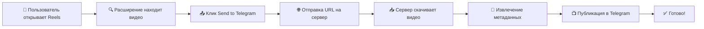

# 📤 Reels to Telegram

[](https://github.com/revoulce/reels-to-telegram)
[](https://github.com/revoulce/reels-to-telegram)
[](LICENSE)
[](https://github.com/revoulce/reels-to-telegram/releases)

> 🚀 Автоматически отправляйте Instagram Reels и Stories в ваш Telegram канал одним кликом!

Полнофункциональное решение состоящее из Chrome расширения и Node.js сервера для автоматической публикации Instagram контента в Telegram каналы.

## ✨ Особенности

### 🎯 **Простота использования**
- 📱 **Один клик** - просто нажмите кнопку на любом Reels или Stories
- ⚡ **Мгновенная отправка** - видео появляется в Telegram за секунды
- 🔄 **Автоматическое извлечение** данных об авторе, описании и статистике
- 📺 **Поддержка форматов** - Reels, Stories, обычные посты Instagram

### 🛡️ **Надежность и безопасность**
- 🔒 **API ключи** для защищенного доступа
- 🧹 **Автоочистка** временных файлов
- ⚡ **Retry механизм** при сбоях сети
- 🛠️ **Graceful handling** ошибок и исключений

### ⚙️ **Гибкая настройка**
- 🌐 **Собственный сервер** - полный контроль над данными
- 📊 **Мониторинг** процесса и статистика
- 🎨 **Кастомизация** формата публикаций
- 🔧 **Автоматическая настройка** через setup скрипт

## 🖼️ Как это выглядит

### Chrome расширение
```
┌─────────────────────────────────┐
│  📤 Send to Telegram            │ ← Кнопка появляется на Reels
└─────────────────────────────────┘
```

### Результат в Telegram
```
🎬 Mythic reel 💀 This is getting out of hand...

👤 @the.mythicwitch
👁 1.2M просмотров
❤️ 89K лайков
⏱ 0:30

🔗 https://www.instagram.com/reels/CwXXX/
```

## 🚀 Быстрый старт

### 1️⃣ Установите сервер
```bash
git clone https://github.com/revoulce/reels-to-telegram.git
cd reels-to-telegram/server
npm install
npm run setup  # Автоматическая настройка
npm start      # Запуск сервера
```

### 2️⃣ Установите расширение
1. Откройте `chrome://extensions/`
2. Включите "Режим разработчика"
3. Загрузите папку `extension/`
4. Настройте URL сервера и API ключ

### 3️⃣ Начните использовать!
1. Откройте любой Instagram Reels
2. Нажмите кнопку "📤 Send to Telegram"
3. Видео автоматически появится в вашем канале

## 📁 Структура проекта

```
reels-to-telegram/
├── 📱 extension/              # Chrome расширение
│   ├── manifest.json         # Манифест расширения
│   ├── content.js            # Скрипт для Instagram страниц
│   ├── background.js         # Фоновый сервис
│   ├── popup.html            # Интерфейс настроек
│   ├── popup.js              # Логика настроек
│   ├── styles.css            # Стили для элементов
│   └── icons/                # Иконки расширения
├── 🖥️ server/                 # Node.js сервер
│   ├── server.js             # Основной сервер
│   ├── setup.js              # Скрипт автонастройки
│   ├── package.json          # Зависимости
│   ├── .env.example          # Пример конфигурации
│   └── temp/                 # Временные файлы
├── 📖 docs/                   # Документация
└── 📄 README.md              # Этот файл
```

## ⚡ Как это работает



### Технический процесс:

1. **🔍 Обнаружение контента**: Расширение сканирует страницу на наличие видео
2. **📊 Извлечение данных**: Получение URL видео и ссылки на пост
3. **🌐 Отправка на сервер**: Передача данных через защищенный API
4. **📥 Загрузка видео**: Сервер скачивает видео используя yt-dlp
5. **🎭 Обработка метаданных**: Автоматическое извлечение автора, описания, статистики
6. **📺 Публикация**: Отправка в Telegram с красивым оформлением

## 🛠️ Установка и настройка

### Требования
- **Node.js** 16+
- **Python 3.6+** (для yt-dlp)
- **Chrome** браузер
- **Telegram** бот и канал

### Подробные инструкции

#### 🖥️ Настройка сервера
См. [server/README.md](server/README.md)

#### 📱 Настройка расширения
См. [extension/README.md](extension/README.md)

#### 🤖 Настройка Telegram бота
1. Создайте бота через [@BotFather](https://t.me/botfather)
2. Получите токен бота
3. Создайте канал и добавьте бота как администратора
4. Получите ID канала (например: `@mychannel`)

## 🔧 Конфигурация

### Server Environment (.env)
```env
PORT=3000
BOT_TOKEN=your_telegram_bot_token
CHANNEL_ID=@your_channel
API_KEY=your-secret-64-char-api-key
```

### Extension Settings
- **Server URL**: `http://localhost:3000`
- **API Key**: Тот же ключ что в `.env`

## 📊 Поддерживаемые форматы

| Тип контента | Поддержка | Метаданные | Примечания |
|--------------|-----------|------------|------------|
| 🎬 **Instagram Reels** | ✅ Полная | ✅ Полные | Основной формат |
| 📖 **Instagram Stories** | ✅ Полная | ⚠️ Ограниченные | Временный контент |
| 📸 **Instagram Posts** | ✅ Видео | ✅ Полные | Только видео посты |
| 📺 **IGTV** | ✅ Полная | ✅ Полные | Длинные видео |

## 🔍 Troubleshooting

### Частые проблемы

#### 🚫 "API ключ не настроен"
- Проверьте настройки расширения
- Убедитесь что API ключ совпадает в `.env` и расширении
- Перезапустите сервер после изменения `.env`

#### 📱 "Кнопка не появляется"
- Обновите страницу Instagram
- Проверьте что расширение включено
- Откройте консоль браузера для ошибок

#### 🌐 "Ошибка подключения к серверу"
- Убедитесь что сервер запущен (`npm start`)
- Проверьте URL сервера в настройках
- Проверьте что порт 3000 не занят

#### 📥 "Ошибка скачивания видео"
- Обновите yt-dlp: `pip install -U yt-dlp`
- Проверьте что видео публичное
- Добавьте Instagram cookies в `cookies.txt`

### Получение логов

#### Расширение (браузер):
```javascript
// В консоли браузера на странице Instagram
reelsDebug.checkStatus()
```

#### Сервер:
```bash
# Логи выводятся в консоль при запуске
npm start
```

## 🎯 Roadmap

### v2.2 (планируется)
- [ ] 🖼️ Поддержка фото карусели
- [ ] 📱 Мобильная версия расширения
- [ ] 🎨 Темы оформления для Telegram
- [ ] 📊 Веб-интерфейс для управления

### v2.3 (планируется)
- [ ] 🔄 Массовая обработка контента
- [ ] ⏰ Отложенная публикация
- [ ] 🏷️ Автоматические теги
- [ ] 📈 Аналитика просмотров

### Идеи для развития
- [ ] 🎵 Поддержка TikTok
- [ ] 💬 Поддержка других мессенджеров
- [ ] 🤖 ИИ для генерации описаний
- [ ] 🔍 Поиск по опубликованному контенту

## 🤝 Contributing

Мы приветствуем вклад в развитие проекта!

### Как помочь:
1. 🐛 **Сообщайте о багах** через Issues
2. 💡 **Предлагайте новые функции**
3. 📖 **Улучшайте документацию**
4. 💻 **Присылайте Pull Requests**

### Процесс разработки:
1. Fork репозиторий
2. Создайте feature branch (`git checkout -b feature/amazing-feature`)
3. Commit изменения (`git commit -m 'Add amazing feature'`)
4. Push в branch (`git push origin feature/amazing-feature`)
5. Откройте Pull Request

## 📜 История версий

### v2.1.0 (текущая) - 2024-12-XX
- ✨ Упрощенное расширение (только URL передача)
- 🔧 Автоматическая настройка сервера
- 🧹 Автоочистка временных файлов
- 📊 Endpoint статистики
- 🛡️ Улучшенная безопасность

### v2.0.0 - 2024-12-XX
- 🎉 Полная переработка архитектуры
- 📱 Современный UI расширения
- 🤖 Улучшенные команды бота
- ⚡ Retry механизм
- 🔒 Настраиваемые API ключи

### v1.0.0 - 2024-XX-XX
- 🚀 Первый релиз
- 📤 Базовая функциональность
- 🎬 Поддержка Reels

## 📄 Лицензия

Этот проект лицензирован под MIT License - см. файл [LICENSE](LICENSE) для деталей.

## 👨‍💻 Автор

**revoulce**
- GitHub: [@revoulce](https://github.com/revoulce)
- Telegram: [@revoulce](https://t.me/revoulce)

## 🙏 Благодарности

- [yt-dlp](https://github.com/yt-dlp/yt-dlp) - за мощный инструмент скачивания
- [Telegraf](https://telegraf.js.org/) - за отличную библиотеку для Telegram
- [Chrome Extensions API](https://developer.chrome.com/docs/extensions/) - за возможности расширений

## 📞 Поддержка

### Нужна помощь?
- 📋 **Документация**: Читайте README в папках `extension/` и `server/`
- 🐛 **Баги**: Создавайте Issues с детальным описанием
- 💬 **Вопросы**: Обсуждения в Discussions
- 📧 **Email**: support@yourproject.com

### Полезные ссылки
- 📖 [Документация по установке](docs/installation.md)
- 🔧 [Руководство по настройке](docs/configuration.md)
- 🐛 [Решение проблем](docs/troubleshooting.md)
- 🎥 [Видео-инструкция](https://youtube.com/watch?v=xxx)

---

<div align="center">

**Сделано с ❤️ для удобства пользователей Instagram и Telegram**

[⭐ Поставьте звезду](https://github.com/revoulce/reels-to-telegram) если проект оказался полезным!

</div>