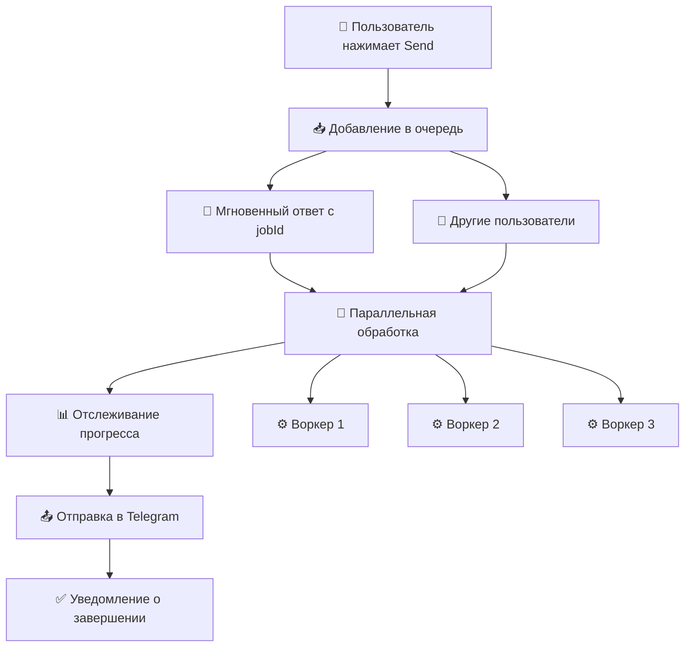

# 📤 Reels to Telegram v3.0

[](https://github.com/revoulce/reels-to-telegram)
[](https://github.com/revoulce/reels-to-telegram)
[](LICENSE)
[](https://github.com/revoulce/reels-to-telegram/releases)

> 🚀 **Революционная система очередей!** Отправляйте множество Instagram Reels и Stories в ваш Telegram канал одновременно без ожидания!

Полнофункциональное решение с **продвинутой системой очередей** состоящее из Chrome расширения и Node.js сервера для автоматической публикации Instagram контента в Telegram каналы.

## ✨ Новые возможности v3.0

### 🚀 **Революционная система очередей**
- ⚡ **Мгновенная отправка** - добавляйте видео в очередь без ожидания
- 🔄 **Параллельная обработка** - до 3 видео одновременно (настраивается)
- 📊 **Отслеживание прогресса** - видите статус каждого видео в реальном времени
- 🎯 **Умное управление** - отмена задач, автоочистка, мониторинг

### 📱 **Улучшенный пользовательский интерфейс**
- 🎨 **Панель очереди** - красивая визуализация всех задач
- 📈 **Прогресс-бары** - точный прогресс загрузки и обработки
- 💡 **Умные уведомления** - информативные сообщения о статусе
- ⌨️ **Горячие клавиши** - Shift+клик или долгое нажатие для панели

### 🛡️ **Надежность и производительность**
- 🔒 **Отказоустойчивость** - ошибка одного видео не влияет на остальные
- 🧹 **Автоочистка** - умное управление временными файлами
- ⚡ **Масштабируемость** - легко увеличить количество воркеров
- 📊 **Мониторинг** - детальная статистика работы очереди

### 🛠️ **Продвинутое API**
- 🌐 **RESTful API** для управления очередью
- 📡 **WebSocket** поддержка для live-обновлений (планируется)
- 🔧 **Гибкая настройка** всех параметров очереди
- 📈 **Метрики и аналитика** производительности

## 🖼️ Как это выглядит

### Chrome расширение с очередью
```
┌─────────────────────────────────┐
│  📤 Send to Telegram (3)        │ ← Кнопка с счетчиком очереди
└─────────────────────────────────┘

┌─────────────────────────────────┐
│  📤 Очередь отправки        × │
├─────────────────────────────────┤
│  ⏳ Reel abc123... (позиция 1)   │
│  🔄 Reel def456... 80% ████▓▓   │
│  ✅ Reel ghi789... Отправлено    │
└─────────────────────────────────┘
```

### Результат в Telegram (улучшенный)
```
🎬 Mythic reel 💀 This is getting out of hand...

👤 @the.mythicwitch
👁 1.2M просмотров
❤️ 89K лайков
⏱ 0:30

🔗 https://www.instagram.com/reels/CwXXX/

📊 Обработано через очередь #3 за 15.2с
```

## 🚀 Быстрый старт

### 1️⃣ Установите сервер с очередями
```bash
git clone https://github.com/revoulce/reels-to-telegram.git
cd reels-to-telegram/server
npm install
npm run setup  # Автоматическая настройка с новыми опциями
npm start      # Запуск сервера с очередями
```

### 2️⃣ Установите обновленное расширение
1. Откройте `chrome://extensions/`
2. Включите "Режим разработчика"
3. Загрузите папку `extension/` (версия 3.0)
4. Настройте URL сервера и API ключ

### 3️⃣ Начните использовать очереди!
1. Откройте любой Instagram Reels
2. Нажмите кнопку "📤 Send to Telegram"
3. **Мгновенно** добавляйте следующие видео - не ждите!
4. **Shift+клик** для просмотра очереди и прогресса

## 📁 Структура проекта v3.0

```
reels-to-telegram/
├── 📱 extension/              # Chrome расширение v3.0
│   ├── manifest.json         # Манифест с новыми permissions
│   ├── content.js            # Скрипт с панелью очереди
│   ├── background.js         # Сервис с мониторингом задач
│   ├── popup.html            # Интерфейс с статистикой очереди
│   ├── popup.js              # Логика с live-мониторингом
│   ├── styles.css            # Стили для панели очереди
│   └── icons/                # Обновленные иконки
├── 🖥️ server/                 # Node.js сервер v3.0
│   ├── server.js             # Сервер с системой очередей
│   ├── setup.js              # Setup с настройками очереди
│   ├── package.json          # Обновленные зависимости
│   ├── .env.example          # Конфиг с параметрами очереди
│   └── temp/                 # Временные файлы (автоочистка)
├── 📖 docs/                   # Обновленная документация
│   ├── queue-system.md       # Документация по очередям
│   ├── api-reference.md      # Справочник API v3.0
│   └── troubleshooting.md    # Решение проблем с очередями
└── 📄 README.md              # Этот файл
```

## ⚡ Как работает система очередей



### Детальный процесс:

1. **📥 Мгновенное добавление**: Расширение отправляет видео в очередь и получает jobId
2. **🎯 Позиционирование**: Задача встает в очередь с указанием позиции
3. **⚡ Параллельная обработка**: До 3 воркеров обрабатывают задачи одновременно
4. **📊 Live-мониторинг**: Прогресс обновляется каждые 2 секунды
5. **🔄 Автоматическое управление**: Завершенные задачи автоудаляются
6. **🧹 Умная очистка**: Временные файлы и старые записи убираются автоматически

## 🛠️ Настройка системы очередей

### Server Environment (.env)
```env
# Базовые настройки
PORT=3000
BOT_TOKEN=your_telegram_bot_token
CHANNEL_ID=@your_channel
API_KEY=your-secret-64-char-api-key

# Настройки очередей (НОВОЕ!)
MAX_CONCURRENT_DOWNLOADS=3      # Максимум одновременных загрузок
MAX_QUEUE_SIZE=50              # Максимум задач в очереди
QUEUE_TIMEOUT=600000           # Таймаут обработки (10 минут)

# Дополнительные настройки
MAX_FILE_SIZE=52428800         # 50MB лимит файла
DOWNLOAD_TIMEOUT=60000         # 60 секунд на загрузку
```

### Extension Settings
- **Server URL**: `http://localhost:3000`
- **API Key**: Тот же ключ что в `.env`
- **Auto-refresh**: Автообновление статистики очереди

## 📊 Новые API Endpoints

### Управление очередью
```http
POST /api/download-video        # Добавить видео в очередь
GET  /api/job/:jobId           # Статус конкретной задачи  
DELETE /api/job/:jobId         # Отменить задачу
GET  /api/queue/stats          # Статистика очереди
GET  /api/queue/jobs           # Список всех задач
```

### Мониторинг
```http
GET /api/health                # Здоровье сервера + очередь
GET /api/stats                 # Расширенная статистика
```

### Пример ответа статистики очереди:
```json
{
  "queued": 5,
  "processing": 2, 
  "activeWorkers": 2,
  "maxWorkers": 3,
  "completed": 127,
  "failed": 3,
  "maxQueueSize": 50,
  "config": {
    "maxConcurrentDownloads": 3,
    "maxQueueSize": 50,
    "queueTimeout": 10
  }
}
```

## 🎮 Использование очередей

### Базовое использование
1. **Быстрая отправка**: Нажимайте "Send to Telegram" на любых видео подряд
2. **Мониторинг**: Видео мгновенно добавляются в очередь
3. **Просмотр прогресса**: Shift+клик или долгое нажатие для панели очереди

### Продвинутые функции
- **Отмена задач**: Крестик на задаче (только в очереди)
- **Приоритизация**: Новые задачи добавляются в конец очереди
- **Автоуправление**: Завершенные задачи исчезают автоматически

### Горячие клавиши
- **Shift + Click**: Открыть/закрыть панель очереди
- **Long Press** (0.5с): Альтернативный способ открытия панели

## 🔍 Troubleshooting очередей

### Частые проблемы v3.0

#### 🚫 "Очередь переполнена"
- Очередь заполнена до максимума (50 задач по умолчанию)
- **Решение**: Дождитесь обработки или увеличьте `MAX_QUEUE_SIZE`

#### 📱 "Панель очереди не открывается"
- Используйте Shift+клик или долгое нажатие
- Проверьте что вы на странице Instagram Reels
- **Решение**: Обновите страницу и попробуйте снова

#### 🔄 "Задачи висят в обработке"
- Возможно превышен таймаут обработки
- **Решение**: Перезапустите сервер или проверьте yt-dlp

#### 📊 "Статистика не обновляется"
- Проверьте подключение к серверу
- **Решение**: Нажмите "🔄 Обновить" в popup

### Получение логов очередей

#### Расширение:
```javascript
// В консоли браузера на странице Instagram
chrome.runtime.sendMessage({action: 'getActiveJobs'}, console.log)
```

#### Сервер:
```bash
# Логи очередей выводятся с префиксами:
# 📥 Job added
# 🚀 Processing job  
# ✅ Job completed
# ❌ Job failed
npm start
```

## 🎯 Roadmap v3.x

### v3.1 (планируется)
- [ ] 🔗 **WebSocket поддержка** для мгновенных обновлений
- [ ] 🎨 **Темы интерфейса** (темная/светлая)
- [ ] 📊 **Детальная аналитика** производительности
- [ ] ⚡ **Приоритетные очереди** для важных видео

### v3.2 (планируется)
- [ ] 🌐 **Распределенная обработка** на несколько серверов
- [ ] 🤖 **ИИ-оптимизация** порядка обработки
- [ ] 📱 **Мобильное приложение** для мониторинга
- [ ] 🔄 **Retry-логика** с экспоненциальной задержкой

### v3.3 (планируется)
- [ ] 📈 **Метрики производительности** и дашборды
- [ ] 🎛️ **Веб-интерфейс** для управления сервером
- [ ] 🔐 **Многопользовательский режим** с ролями
- [ ] 🌍 **Локализация** интерфейса

## 🤝 Contributing

Мы особенно приветствуем вклад в развитие системы очередей!

### Приоритетные области:
1. 🚀 **Оптимизация производительности** очередей
2. 🎨 **UI/UX улучшения** панели очереди
3. 📊 **Мониторинг и метрики**
4. 🔧 **API расширения** для очередей

### Процесс разработки:
1. Fork репозиторий
2. Создайте feature branch (`git checkout -b feature/queue-enhancement`)
3. Commit изменения (`git commit -m 'Add queue enhancement'`)
4. Push в branch (`git push origin feature/queue-enhancement`)
5. Откройте Pull Request

## 📜 История версий

### v3.0.0 (текущая) - 2024-12-XX
- 🎉 **Революционная система очередей!**
- ⚡ **Параллельная обработка** до 3 видео одновременно
- 📊 **Live-мониторинг** прогресса обработки
- 🎨 **Панель очереди** с визуализацией
- 🔧 **Новые API endpoints** для управления
- 📈 **Статистика очереди** в реальном времени

### v2.1.0 - 2024-12-XX
- ✨ Упрощенное расширение (только URL передача)
- 🔧 Автоматическая настройка сервера
- 🧹 Автоочистка временных файлов
- 📊 Endpoint статистики
- 🛡️ Улучшенная безопасность

### v2.0.0 - 2024-12-XX
- 🎉 Полная переработка архитектуры
- 📱 Современный UI расширения
- 🤖 Улучшенные команды бота
- ⚡ Retry механизм
- 🔒 Настраиваемые API ключи

## 📄 Лицензия

Этот проект лицензирован под MIT License - см. файл [LICENSE](LICENSE) для деталей.

## 👨‍💻 Автор

**revoulce**
- GitHub: [@revoulce](https://github.com/revoulce)
- Telegram: [@revoulce](https://t.me/revoulce)

## 🙏 Благодарности

- [yt-dlp](https://github.com/yt-dlp/yt-dlp) - за мощный инструмент скачивания
- [Telegraf](https://telegraf.js.org/) - за отличную библиотеку для Telegram
- [Chrome Extensions API](https://developer.chrome.com/docs/extensions/) - за возможности расширений
- **Community** - за идеи и фидбек по системе очередей

## 📞 Поддержка

### Нужна помощь с очередями?
- 📋 **Документация**: Читайте [docs/queue-system.md](docs/queue-system.md)
- 🐛 **Баги очередей**: Создавайте Issues с тегом `queue`
- 💬 **Вопросы**: Обсуждения в Discussions
- 📧 **Email**: support@yourproject.com

### Полезные ссылки v3.0
- 📖 [Документация по очередям](docs/queue-system.md)
- 🔧 [Руководство по API](docs/api-reference.md)
- 🐛 [Решение проблем с очередями](docs/troubleshooting.md)
- 🎥 [Видео-демо системы очередей](https://youtube.com/watch?v=xxx)

---

<div align="center">

**🚀 Революция в обработке Instagram видео с продвинутыми очередями! 🚀**

**Отправляйте множество видео одновременно без ожидания!**

[⭐ Поставьте звезду](https://github.com/revoulce/reels-to-telegram) если система очередей оказалась полезной!

**Сделано с ❤️ и передовыми технологиями очередей**

</div>